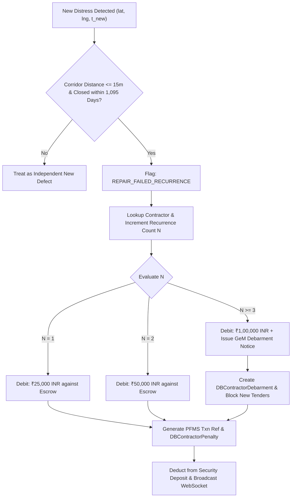

# Phase 3: Contractor Financial Accountability & SLA Ledger — Research Findings

**Phase Code:** `ROAD-03-contractor-financial-accountability-sla-ledger`  
**Date:** 2026-10-06  
**Status:** Completed  
**Author:** Custom Phase Technical Researcher (RoadSaathi)  

---

## Executive Summary

Phase 3 delivers autonomous financial recovery, defect liability tracking, and work order concurrence validation under Indian Roads Congress standards (**IRC:SP:20 Clause 14** and **MoRTH Section 3000**). In Indian municipal road management, taxpayers routinely lose crores to low-quality contractor repairs that fail within months. Because inspection is manual, contractors self-certify work, cash invoices, and escape liability when repaired potholes reappear.

RoadSaathi eliminates manual clearance and enforces autonomous financial accountability through two core pillars:
1. **Statutory Penalty Calculation Engine (IRC:SP:20 Clause 14 & 36-Month DLP)**: An automated debit engine that correlates newly reported defects against previously resolved work orders within a 15-meter buffer and 36-month (1,095 days) Defect Liability Period (DLP), applying a strict tiered penalty schedule (1st recurrence: ₹25,000; 2nd: ₹50,000; 3rd: ₹1,00,000 + Government e-Marketplace [GeM] debarment notice).
2. **Multi-Pass Concurrence Gating Protocol**: A tamper-proof physical verification gate that forbids invoice clearance and escrow release until at least **3 distinct public transit fleet vehicles** cross the repaired coordinates across a 48-hour monitoring window with dual-sensor validation: optical absence of cavity/crack bounding boxes AND calibrated vertical IMU accelerometer acceleration $|g_z - 1.0| < 0.15g$ ($0.85g \le g_z \le 1.15g$).

This research investigates the statutory formulas, spatial-temporal database queries (with dual PostGIS / SQLite Haversine execution), REST API architecture, Public Financial Management System (PFMS) transaction compliance, state machine lifecycles, frontend React component bindings, and an exhaustive validation architecture.

---

## 1. Statutory Penalty Calculation Engine (IRC:SP:20 Clause 14 & 36-Month DLP)

### 1.1 Statutory Framework & IRC:SP:20 Clause 14
Under Indian Roads Congress standard **IRC:SP:20** (*Rural and Urban Road Maintenance Handbook*) and Ministry of Road Transport and Highways (**MoRTH**) Section 3000 specifications:
- Road construction, resurfacing, and asphalt overlay contracts require contractors to furnish a **Security Deposit / Bank Guarantee Escrow** (typically 5% to 10% of total contract value, representing ₹25,00,000 to ₹50,00,000 per corridor package).
- Contractors are legally bound to a mandatory **36-month (1,095 days) Defect Liability Period (DLP)** starting from the date of initial work completion.
- Under Clause 14.2, any failure, cavity recurrence, or premature asphalt rutting occurring within the DLP must be rectified at contractor cost. If the repair itself fails, liquidated damages and statutory penalty debits must be levied directly against the held Security Deposit.

### 1.2 Tiered Recurrence Penalty Formula

When transit fleet sensors detect recurrent road distress on a previously repaired asset within the 36-month DLP, the statutory debit is calculated using a deterministic tiered escalation:

$$\text{Debit}(N) = \begin{cases} 
₹25,000 & \text{for } N = 1 \text{ (1st recurrence within 36 months)} \\
₹50,000 & \text{for } N = 2 \text{ (2nd recurrence within 36 months)} \\
₹1,00,000 + \text{Debarment Notice} & \text{for } N \ge 3 \text{ (3rd+ recurrence; trigger GeM Blacklist)}
\end{cases}$$

Where $N$ is the cumulative count of verified defect recurrences for the specific contractor on the designated corridor segment within the 36-month liability window.



### 1.3 Spatial-Temporal Correlation Engine
To definitively attribute a newly detected hazard to a previously closed work order, the engine enforces strict dual-variable correlation:
1. **Spatial Corridoring Buffer ($\le 15.0\text{ meters}$)**:
   Urban buses travel in designated lanes; GPS multipath errors in dense corridors (e.g., Anna Salai or GST Road) can introduce slight location drift ($\pm 3-8\text{m}$). A 15-meter geodesic radius encapsulates the road width and approach framing while avoiding false attribution to adjacent parallel service lanes.
2. **Temporal Defect Liability Window ($\le 1,095\text{ days}$)**:
   The elapsed time $\Delta t = t_{\text{detected}} - t_{\text{resolved}}$ must be within $36 \times 30.416 \approx 1,095\text{ days}$. If $\Delta t > 1,095\text{ days}$, the statutory warranty has expired; the defect is logged as a standard wear-and-tear defect without contractor financial penalty.

### 1.4 Dual-Dialect SQLAlchemy Query Execution
Following the Phase 1 dual-dialect engine standards, spatial recurrence matching must execute seamlessly across both PostgreSQL 16 + PostGIS 3.4 and SQLite 3.

#### PostgreSQL 16 + PostGIS Dialect:
```python
from sqlalchemy import text
from sqlalchemy.orm import Session

def find_recurrent_cluster_postgis(
    lat: float, 
    lng: float, 
    detection_time: datetime, 
    db: Session,
    corridor_buffer_m: float = 15.0
):
    stmt = text("""
        SELECT id, cluster_code, assigned_agency, road_name, status, updated_at,
               ST_Distance(geom::geography, ST_SetSRID(ST_Point(:lng, :lat), 4326)::geography) AS distance_meters
        FROM distress_clusters
        WHERE status IN ('resolved', 'verified_closed')
          AND ST_DWithin(geom::geography, ST_SetSRID(ST_Point(:lng, :lat), 4326)::geography, :buffer_m)
        ORDER BY distance_meters ASC
        LIMIT 1
    """)
    row = db.execute(stmt, {"lat": lat, "lng": lng, "buffer_m": corridor_buffer_m}).mappings().first()
    return row
```

#### SQLite WAL Mode Fallback (Python Geodesic Evaluation):
For SQLite, a coarse bounding box filter ($\Delta \text{lat} \approx 15\text{m} / 111,320\text{m} \approx 0.000135^\circ$) extracts candidate closed clusters, followed by exact Great Circle distance filtering:
```python
from app.spatial.poi_database import haversine_distance_m

def find_recurrent_cluster_sqlite(
    lat: float, 
    lng: float, 
    detection_time: datetime, 
    db: Session,
    corridor_buffer_m: float = 15.0
):
    delta_deg = 0.00025  # ~27 meters bounding box
    candidates = db.query(DBDistressCluster).filter(
        DBDistressCluster.status.in_(["resolved", "verified_closed"]),
        DBDistressCluster.lat.between(lat - delta_deg, lat + delta_deg),
        DBDistressCluster.lng.between(lng - delta_deg, lng + delta_deg)
    ).all()
    
    best_candidate = None
    min_dist = float("inf")
    
    for c in candidates:
        dist = haversine_distance_m(lat, lng, c.lat, c.lng)
        if dist <= corridor_buffer_m and dist < min_dist:
            min_dist = dist
            best_candidate = c
            
    return best_candidate, min_dist
```

### 1.5 Database Model Synchronization & Escrow Deductions
When a recurrence penalty is triggered:
1. `DBDistressCluster`: Status updated to `REPAIR_FAILED_RECURRENCE`.
2. `DBContractorPenalty`: Inserted with statutory clause `"MoHUA IRC:SP:20 Clause 14.2 (Defect Recurrence Penalty)"`, penalty amount, PFMS reference, and cluster code.
3. `DBContractor`: Deducts `penalty_amount_inr` from `penalties_deducted_inr`. Net remaining balance is capped at 0 (preventing negative balances under threat model T-03-02); if penalties exceed security deposit, an immediate critical alert is triggered.
4. `DBRepairAudit`: Appends audit verdict `REPAIR_FAILED_RECURRENCE` with recorded $g_z$ vertical jerk.
5. If $N \ge 3$: Inserts `DBContractorDebarment` record with `debarment_status="STATUTORY_DEBARMENT_NOTICE"` and GeM portal reference.

---

## 2. Contractor Financial Ledger & Escrow Management API

### 2.1 REST API Endpoint Architecture
Phase 3 establishes a dedicated REST endpoint namespace `/api/contractors` backed by persistent database models:

| Method | Endpoint | Description |
|---|---|---|
| `GET` | `/api/contractors/ledger` | Returns performance scorecard for all contractors: initial bond, penalties deducted, remaining balance, active/resolved/breached orders, SLA on-time %, quality score, and debarment risk. |
| `GET` | `/api/contractors/penalties` | Lists historical penalty dockets with cluster code, corridor, patrol bus ID, measured $g_z$, penalty amount, PFMS txn ref, and statutory clause. |
| `GET` | `/api/contractors/{id}/escrow` | Detailed escrow balance sheet for a specific contractor: bank guarantee details, holdback releases, and PFMS settlement audit log. |
| `POST` | `/api/contractors/penalties/auto-debit` | Triggers automated statutory evaluation of telemetry against closed clusters, executes statutory debit, and logs PFMS transaction. |
| `GET` | `/api/contractors/debarments` | Lists contractors flagged for GeM e-procurement debarment and demerit dossiers. |

### 2.2 Public Financial Management System (PFMS) Mock Reference Format
Government financial audits under the Comptroller and Auditor General (CAG) and Ministry of Finance require unique, verifiable voucher references for municipal bank guarantee adjustments.
RoadSaathi generates deterministic, cryptographically linked PFMS references:

$$\text{Ref} = \text{PFMS/DLP-ESCROW/}\{YYYY\}/\{MMDD\}\text{-}\{HEX6\}$$
Example: `PFMS/DLP-ESCROW/2026/1006-8A4F91`

Along with each transaction, a SHA-256 tamper-proof hash is generated:
$$\text{Hash} = \text{SHA256}(\text{contractor\_cin} \parallel \text{cluster\_code} \parallel \text{penalty\_amount} \parallel \text{timestamp})$$

### 2.3 Ledger Aggregation Formulae
For each contractor $C_i$:
- **Net Remaining Security Escrow**:
  $$\text{Balance}_{\text{rem}} = \max\left(0, \text{Deposit}_{\text{total}} - \sum \text{Penalties}_{\text{deducted}}\right)$$
- **On-Time SLA Percentage**:
  $$\text{SLA}_{\text{pct}} = \frac{\text{Orders}_{\text{resolved\_ontime}}}{\text{Orders}_{\text{total}}} \times 100$$
- **Quality Index**:
  $$\text{Quality}_{\text{pct}} = 100 - (\text{Recurrences} \times 12.5) - (\text{SLA Breaches} \times 5.0)$$
- **Debarment Risk Scoring**:
  $$\text{Risk} = \begin{cases}
  \text{"Critical Debarment Warning"} & \text{if } N_{\text{recurrence}} \ge 3 \text{ or } \text{Balance}_{\text{rem}} < 0.20 \times \text{Deposit}_{\text{total}} \\
  \text{"Medium"} & \text{if } N_{\text{recurrence}} = 2 \text{ or } \text{SLA}_{\text{pct}} < 80\% \\
  \text{"Low"} & \text{otherwise}
  \end{cases}$$

---

## 3. Multi-Pass Concurrence Gating Engine

### 3.1 The Physical Verification Problem
In municipal works, contractors frequently submit fraudulent "after-repair" photos or apply cosmetic thin sand-slurry coatings that erode during the next rainfall (Threat T-03-01). 
RoadSaathi forbids manual closing of work orders by human officers or contractor self-clearance. A work order cannot transition to `REPAIR_VERIFIED` or authorize payment clearance without automated physical concurrence from transit fleet sensors.

### 3.2 Concurrence Criteria
A completed repair must strictly satisfy the following criteria:
1. **Cross-Bus Diversity**: At least **3 distinct fleet vehicles** (`bus_id`s, e.g., `BUS-04`, `BUS-18`, `BUS-29`) must pass over the repair coordinates. Repetitive passes by the same bus only count as 1 distinct verification, eliminating sensor bias or accelerometer miscalibration.
2. **Monitoring Window**: All 3 qualifying passes must occur within a **48-hour monitoring window** following contractor repair submission.
3. **Dual-Sensor Verification per Pass**:
   - **Optical Telematics**: The onboard neural network must classify the patch as clear / smooth asphalt (absence of D40/D20 bounding box with confidence $< 0.10$, status `SMOOTH_SURFACE`).
   - **Vertical IMU Acceleration**: The vertical accelerometer must record smooth pavement dynamics:
     $$|g_z - 1.0| < 0.15g \quad \implies \quad 0.85g \le g_z \le 1.15g$$
   - **Rejection / Recurrence Threshold**: If any pass exhibits vertical shock $|g_z - 1.0| \ge 0.35g$ (i.e. $g_z \ge 1.35g$ or $g_z \le 0.65g$) or detects an open cavity, the entire verification immediately fails and shifts to `REPAIR_FAILED_RECURRENCE`.

```
48-Hour Concurrence Gating Window
─────────────────────────────────────────────────────────────────────────────► Time
  │
  ├─► Pass 1: Bus #04  (Gz = 0.98g, Optical: SMOOTH)  ──► [Pass 1/3 Approved]
  │
  ├─► Pass 2: Bus #18  (Gz = 1.02g, Optical: SMOOTH)  ──► [Pass 2/3 Approved]
  │
  ├─► Pass 3: Bus #29  (Gz = 0.97g, Optical: SMOOTH)  ──► [Pass 3/3 Approved]
  │                                                              │
  │                                                              ▼
  └───────────────────────────────────────────────────► [REPAIR_VERIFIED]
                                                        - Escrow Holdback Released
                                                        - Invoice Clearance Authorized
```

### 3.3 Work Order Lifecycle State Machine
The lifecycle transitions through auditable phases:

```
[open] ──► [assigned] ──► [in_progress]
                               │
            Contractor submits repair sign-off
                               ▼
                    [AWAITING_CONCURRENCE]
                               │
        ┌──────────────────────┴──────────────────────┐
        ▼                                             ▼
  3 Distinct Passes                             Any Pass Fails
  Optical Clear AND                             Optical Cavity OR
  |Gz - 1.0| < 0.15g                            |Gz - 1.0| >= 0.35g
        │                                             │
        ▼                                             ▼
 [REPAIR_VERIFIED]                        [REPAIR_FAILED_RECURRENCE]
 - Payment Authorized                     - Statutory Penalty Debited
 - Escrow Released                        - Work Order Reopened
```

### 3.4 Concurrence Verification Endpoint
`POST /api/work-orders/{order_id}/verify-concurrence`
- Queries `DBRepairAudit` and `DBRawIngest` within 15 meters of cluster coordinates.
- Groups telematics passes by `bus_id`.
- Evaluates optical status and accelerometer $g_z$ against threshold $|g_z - 1.0| < 0.15g$.
- Returns detailed pass verification dockets, distinct bus count, remaining hours in window, and invoice clearance authorization flag.

---

## 4. Frontend Integration Architecture

### 4.1 Binding `ContractorSlaLedger.tsx` to Live APIs
Currently, `ContractorSlaLedger.tsx` relies on static mock constants `INITIAL_CONTRACTORS` and `INITIAL_AUTO_DEBITS`. The component will be refactored to fetch live state from backend endpoints:

1. **State Management**:
   - `useEffect` hook fetching `/api/contractors/ledger` and `/api/contractors/penalties`.
   - Real-time updates via WebSocket subscriptions (`manager.broadcast({"type": "CONTRACTOR_LEDGER_UPDATE"})`).
2. **Interactive Clause 14 Auto-Debit Execution**:
   - The "Trigger Clause 14 Auto-Debit Demo" button will dispatch a live HTTP request to `POST /api/contractors/penalties/auto-debit` with sample telemetry shock ($g_z = 1.48g$).
   - Upon receiving the executed PFMS voucher payload, the component automatically updates the table, adjusts security deposit balances, and triggers the `auto_debit_voucher` modal with authentic PFMS references.

### 4.2 Updating `WorkOrderActionConsole.tsx` (Tab 3: Re-Pass Verification)
Currently, Tab 3 simulates a single bus pass with a hardcoded timeout. The updated architecture provides:
1. **3-Pass Concurrence Progress Indicator**:
   - Displays 3 discrete verification cards: Pass 1 (Bus A), Pass 2 (Bus B), Pass 3 (Bus C).
   - Live telemetry status badges: Optical Classification (`SMOOTH_SURFACE`), IMU $g_z$ reading, and delta from nominal ($|g_z - 1.0| < 0.15g$).
2. **Interactive Accelerometer $g_z$ Sparkline**:
   - Renders visual vertical acceleration graph highlighting the $\pm 0.15g$ green tolerance band ($0.85g - 1.15g$) and $\ge 0.35g$ red failure threshold.
3. **Invoice Clearance Payment Lock**:
   - Replaces the generic closure button with a conditional "Authorize Payment & Release Escrow" action that remains disabled until `concurrence_passes_count >= 3`.

---

## 5. Threat Model & Security Mitigations

| Threat ID | Threat Vector | Mitigation Strategy |
|---|---|---|
| **T-03-01** | **Fraudulent Contractor Self-Clearing**: Contractor attempts to forge repair completion photos or bypass inspection. | Multi-pass concurrence strictly blocks manual administrative sign-offs. The state machine will NOT enter `REPAIR_VERIFIED` without 3 independent bus passes within 48h. |
| **T-03-02** | **Escrow Over-Deduction / Negative Balance**: Statutory penalties exceed the contractor's remaining security deposit. | The auto-debit engine enforces $\text{Balance} = \max(0, \text{Deposit} - \text{Debit})$. Any excess penalty flags an immediate critical GeM tender disqualification. |
| **T-03-03** | **Telematics Pass Spoofing / Replay**: Malicious agent sends duplicate fake telematics pings claiming smooth road. | Passes must originate from authenticated fleet nodes with distinct `bus_id`s, sequential timestamps, and valid AIS-140 telematics credentials. |

---

## 6. Validation Architecture

To guarantee the reliability, statutory correctness, and audit compliance of Phase 3 features, the following automated testing suite must be implemented and executed:

```
                          Phase 3 Test Suite Architecture
 ┌──────────────────────────────────────┐  ┌──────────────────────────────────────┐
 │     test_contractor_ledger.py        │  │     test_concurrence_gating.py       │
 ├──────────────────────────────────────┤  ├──────────────────────────────────────┤
 │ • test_tiered_penalty_formula        │  │ • test_distinct_bus_diversity_rule   │
 │ • test_36_month_dlp_window_boundary  │  │ • test_three_pass_concurrence_pass   │
 │ • test_15m_corridor_spatial_buffer   │  │ • test_vertical_gz_tolerance_band    │
 │ • test_escrow_deduction_and_cap      │  │ • test_recurrent_shock_triggers_fail │
 │ • test_pfms_txn_ref_format           │  │ • test_verify_concurrence_endpoint   │
 │ • test_contractor_ledger_endpoints   │  │ • test_payment_clearance_lock        │
 └──────────────────────────────────────┘  └──────────────────────────────────────┘
```

### 6.1 Automated Test Commands

Execute the Phase 3 backend verification suite via pytest:
```bash
# Run contractor financial ledger and statutory penalty tests
$env:PYTHONPATH="backend"; pytest backend/tests/test_contractor_ledger.py -v

# Run multi-pass concurrence gating and sensor verification tests
$env:PYTHONPATH="backend"; pytest backend/tests/test_concurrence_gating.py -v

# Run complete Phase 1-3 regression test suite
$env:PYTHONPATH="backend"; pytest backend/tests/test_spatial.py backend/tests/test_contractor_ledger.py backend/tests/test_concurrence_gating.py -v
```

### 6.2 Specific Verification Tests: Statutory Penalty Calculation & 36-Month DLP
File: `backend/tests/test_contractor_ledger.py`

1. **Tiered Penalty Calculation Test (`test_tiered_penalty_formula`)**:
   - Seed resolved cluster with contractor `CTR-01`.
   - Ingest 1st recurrence within 15m corridor $\implies$ assert debit amount is exactly ₹25,000 INR.
   - Ingest 2nd recurrence $\implies$ assert debit amount is exactly ₹50,000 INR.
   - Ingest 3rd recurrence $\implies$ assert debit amount is exactly ₹1,00,000 INR and `DBContractorDebarment` record is created with `STATUTORY_DEBARMENT_NOTICE`.

2. **36-Month (1,095 Days) DLP Boundary Test (`test_36_month_dlp_window_boundary`)**:
   - Test date arithmetic at 1,094 days ($< 1,095$) $\implies$ recurrence penalty issued.
   - Test date arithmetic at 1,096 days ($> 1,095$) $\implies$ warranty expired, zero statutory penalty, flagged as new independent distress.

3. **15-Meter Corridor Buffer Test (`test_15m_corridor_spatial_buffer`)**:
   - Test defect detected at 8.5m from resolved work order $\implies$ matched as recurrence.
   - Test defect detected at 22.0m from resolved work order $\implies$ outside buffer, not penalized against previous contractor.

4. **Escrow Balance Deduction and Non-Negative Cap (`test_escrow_deduction_and_cap`)**:
   - Seed contractor with ₹1,00,000 security deposit.
   - Apply ₹75,000 debit $\implies$ remaining balance ₹25,000.
   - Apply subsequent ₹50,000 debit $\implies$ remaining balance capped at ₹0 (no negative balance), debarment alert triggered.

5. **PFMS Transaction Reference Integrity (`test_pfms_txn_ref_format`)**:
   - Verify transaction reference regex matches `^PFMS/DLP-ESCROW/\d{4}/\d{4}-[A-F0-9]{6}$`.
   - Verify SHA-256 evidence link integrity.

### 6.3 Specific Verification Tests: Multi-Pass Concurrence Gating Engine
File: `backend/tests/test_concurrence_gating.py`

1. **Cross-Bus Diversity Rule (`test_distinct_bus_diversity_rule`)**:
   - Ingest 3 passes all originating from `BUS-01`.
   - Evaluate concurrence $\implies$ distinct bus count is 1; status remains `AWAITING_CONCURRENCE`; invoice clearance rejected.

2. **3-Pass Concurrence Acceptance (`test_three_pass_concurrence_pass`)**:
   - Ingest 3 passes from `BUS-01`, `BUS-02`, and `BUS-03` within 48h with $g_z \in \{0.98g, 1.02g, 0.95g\}$ and optical status `SMOOTH_SURFACE`.
   - Evaluate concurrence $\implies$ distinct bus count is 3; status transitions to `REPAIR_VERIFIED`; invoice clearance authorized.

3. **Vertical Acceleration Tolerance Band (`test_vertical_gz_tolerance_band`)**:
   - Test pass with $g_z = 1.12g$ ($|g_z - 1.0| = 0.12g < 0.15g$) $\implies$ approved.
   - Test pass with $g_z = 1.25g$ ($|g_z - 1.0| = 0.25g \ge 0.15g$) $\implies$ rejected as non-smooth.

4. **Recurrent Shock Trigger (`test_recurrent_shock_triggers_fail`)**:
   - Test pass with $g_z = 1.45g$ ($|g_z - 1.0| = 0.45g \ge 0.35g$) $\implies$ immediate state transition to `REPAIR_FAILED_RECURRENCE`, statutory penalty engine invoked.

5. **Endpoint Contract Test (`test_verify_concurrence_endpoint`)**:
   - `POST /api/work-orders/{order_id}/verify-concurrence` returns schema containing `order_id`, `status`, `distinct_buses_count`, `required_buses_count`, `passes`, and `invoice_clearance_authorized`.

---

## 7. Implementation Plan Breakdown

Following the research findings, Phase 3 will be executed across two sequential, atomic plans:

1. **Plan 03-01: IRC:SP:20 Clause 14 Automated Contractor Penalty Calculation & Escrow Ledger Backend**:
   - Extend `db_models.py` with `DBContractor` and extend `DBDistressCluster` fields.
   - Implement `contractor_service.py` with tiered penalty formula, 15m / 36-month spatial-temporal correlation, and PFMS voucher generator.
   - Create endpoints in `backend/app/api/endpoints/contractors.py` (`/ledger`, `/penalties`, `/{id}/escrow`, `/penalties/auto-debit`, `/debarments`).
   - Register router in `backend/app/api/router.py`.
   - Implement comprehensive automated test suite `backend/tests/test_contractor_ledger.py`.

2. **Plan 03-02: Work Order Multi-Pass Concurrence Gating UI & Contractor SLA Audit Console**:
   - Implement concurrence gating engine in `concurrence_service.py` and endpoint `POST /api/work-orders/{order_id}/verify-concurrence`.
   - Implement automated test suite `backend/tests/test_concurrence_gating.py`.
   - Update `frontend/src/services/api.ts` with contractor ledger and concurrence verification methods.
   - Refactor `ContractorSlaLedger.tsx` to bind to live REST endpoints with real-time refresh and auto-debit trigger.
   - Refactor `WorkOrderActionConsole.tsx` Tab 3 with live 3-pass concurrence cards, $g_z$ sparkline, and invoice payment release gating.

---

## Conclusion

The architecture established in this research document bridges field physical reality (transit bus telematics and vertical accelerometers) with legal and financial statutory mechanisms (IRC:SP:20 Clause 14, PFMS vouchers, and GeM debarment notices). By automating both the detection of defect recurrence and the gating of repair payments behind independent transit concurrence, RoadSaathi creates an incorruptible digital audit loop that protects taxpayer funds and guarantees high-standard municipal road infrastructure.
