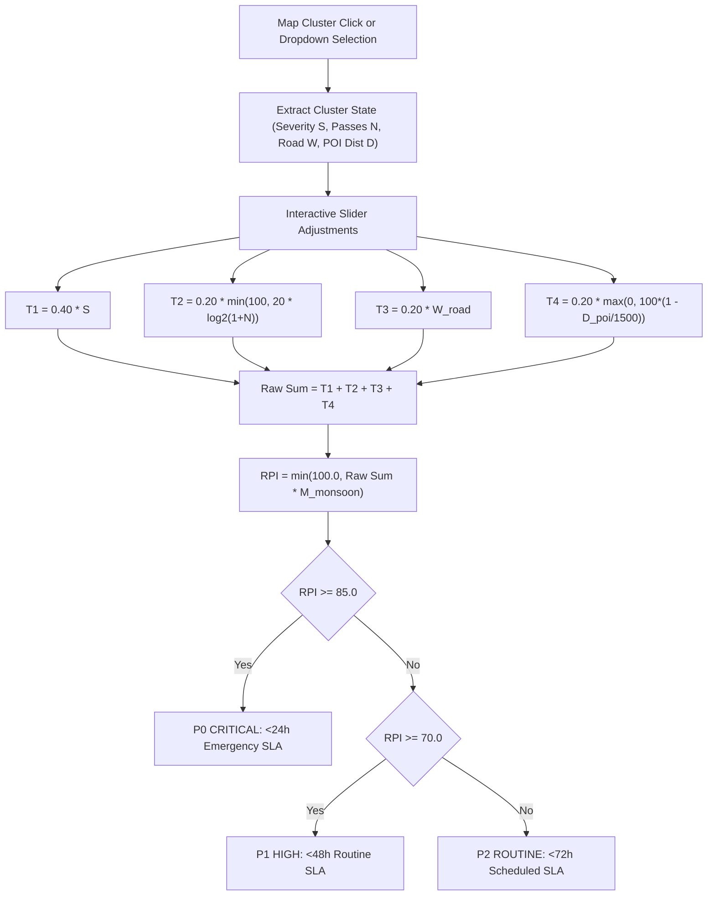
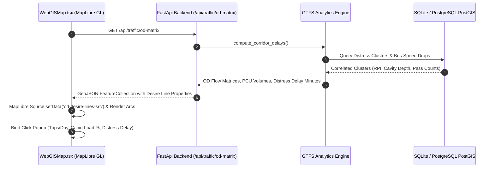

# Phase 4 Research: Explainable WebGIS & Live Presentation Visualizer

**Phase:** ROAD-04  
**Date:** 2026-10-06  
**Status:** Completed  
**Requirements Addressed:** `GIS-01`, `GIS-02`, `GIS-03`  
**Target File:** `C:\Users\sauja\Downloads\roads\.planning\phases\ROAD-04-explainable-webgis-live-presentation-visualizer\04-RESEARCH.md`

---

## 1. Executive Research Summary

Phase 4 bridges deep computer vision, statutory road maintenance standards (IRC:82:2015, IRC:37:2018, IRC:35:2015, IRC:SP:20), and spatial GIS presentation into an unassailable civic decision support system. The investigation analyzed the mathematical consistency, client-side rendering pipeline, real-time telemetry synchronization, and origin-destination transit modeling across the full stack.

### Key Architectural Findings:
1. **Explainable RPI Mathematical Model (`GIS-01`)**:
   - The statutory Road Priority Index (RPI) calculation is mathematically formulated with strict bounded terms, ensuring that no combination of inputs exceeds the $[0.0, 100.0]$ range.
   - Real-time reactivity in [RPIFormulaModal.tsx](file:///c:/Users/sauja/Downloads/roads/frontend/src/components/modals/RPIFormulaModal.tsx) uses controlled slider state linked to active MapLibre cluster selections, dynamically rendering term breakdowns ($T_1, T_2, T_3, T_4$), monsoon risk multipliers, and statutory SLA classifications (P0 <24h, P1 <48h, P2 <72h).
2. **Live Dashcam 30 FPS Perception Tracking & Telemetry Sidecar (`GIS-02`)**:
   - The video perception studio in [UploadFootageModal.tsx](file:///c:/Users/sauja/Downloads/roads/frontend/src/components/modals/UploadFootageModal.tsx) executes a zero-latency `requestAnimationFrame` loop on an HTML5 `<canvas>` layer positioned directly above native `<video>` elements.
   - Renders 30 FPS color-coded bounding boxes, confidence tags, DPDP Act 2023 face/license plate redaction bounding masks, and 3D wireframe depth grids with cylindrical cavity volume estimation ($V = \frac{\pi}{4} \cdot d^2 \cdot h$).
   - Synchronized telemetry sidecars stream real-time 5Hz coordinates, speed, vertical IMU shock acceleration ($g_z$), and optical match probabilities.
   - Pre-bundled offline scenario clips in `/sample_clips/` provide instant demonstration across 4 key civic corridors without network dependency.
3. **PS 26124 Origin-Destination Transit Desire Lines (`GIS-03`)**:
   - The MapLibre GL layer in [WebGISMap.tsx](file:///c:/Users/sauja/Downloads/roads/frontend/src/components/map/WebGISMap.tsx) renders curvature-interpolated GeoJSON desire lines connecting key multimodal transit hubs across Chennai (Central, Guindy, Tambaram, OMR Tidel Park, Kathipara Cloverleaf, Koyambedu CMBT).
   - Dynamic stroke weights and color scales map daily passenger transit flows ($<10\text{k}$, $10\text{k}-25\text{k}$, $>25\text{k}$ trips/day) with interactive popups detailing International Roughness Index (IRI) transit delays and cabin capacity percentages.
   - Backed by backend endpoints in [traffic.py](file:///c:/Users/sauja/Downloads/roads/backend/app/api/endpoints/traffic.py) (`/api/traffic/od-matrix`, `/api/traffic/density`) and [analytics.py](file:///c:/Users/sauja/Downloads/roads/backend/app/api/endpoints/analytics.py) (`/api/analytics/transit-delays`).

---

## 2. Topic 1: Explainable RPI Mathematical Model & Interactive Sliders (GIS-01)

### 2.1 Statutory Mathematical Formulation
The Road Priority Index (RPI) follows Decision **D-01** and aligns with MoHUA / CRDDC road asset valuation guidelines:

$$\text{RPI} = \min\left(100.0, \left(0.40 \cdot S + 0.20 \cdot \min\left(100, 20 \cdot \log_2(1 + N)\right) + 0.20 \cdot W_{\text{road}} + 0.20 \cdot \max\left(0, 100 \left(1 - \frac{D_{\text{poi}}}{1500}\right)\right)\right) \cdot M_{\text{monsoon}}\right)$$

#### Component Breakdown:
| Parameter | Symbol | Range | Statutory Weight | Description |
|---|---|---|---|---|
| **Defect Severity** | $S$ | $[0, 100]$ | $40\%$ ($w_1 = 0.40$) | Raw severity derived from defect type: Pothole cavity (D40 = 100), Alligator fatigue crack (D20 = 75), Longitudinal/Transverse crack (D10/D00 = 55/30). |
| **Consensus Passes** | $N$ | $[1, 50]$ | $20\%$ ($w_2 = 0.20$) | Multi-bus corroboration scaled via $\min(100, 20 \cdot \log_2(1 + N))$. Logarithmic scaling ensures 1 pass = 20 pts, 3 passes = 40 pts, 7 passes = 60 pts, 15 passes = 80 pts, and 31+ passes = 100 pts. |
| **Road Hierarchy** | $W_{\text{road}}$ | $[0, 100]$ | $20\%$ ($w_3 = 0.20$) | Priority weight of the carriageway: National Highway/Expressway (100 pts), Major Arterial (85 pts), State Highway/Collector (70 pts), Local Municipal Street (40-50 pts). |
| **POI Proximity** | $D_{\text{poi}}$ | $[0, 1500\text{ m}]$ | $20\%$ ($w_4 = 0.20$) | Geodesic distance to nearest hospital, school, or transit interchange: $\max(0, 100(1 - D_{\text{poi}}/1500))$. Hospital/School zones within 50m score $\approx 96.7$ pts; locations beyond 1500m score 0 pts. |
| **Monsoon Multiplier** | $M_{\text{monsoon}}$ | $[1.0, 1.30]$ | Multiplicative | IMD precipitation distress expansion factor: Normal weather ($1.0\times$), IMD Rain Warning ($1.15\times$), Severe Flood Warning ($1.30\times$). |

### 2.2 SLA Category Transition Thresholds
The recalculated score dynamically updates the statutory SLA category and dispatch countdown:
- **P0 Critical ($\text{RPI} \ge 85.0$)**: Immediate emergency dispatch with $<24\text{h}$ SLA, automated CAD work order trigger, and high-visibility red badge.
- **P1 High ($70.0 \le \text{RPI} < 85.0$)**: Expedited municipal dispatch with $<48\text{h}$ SLA and amber badge.
- **P2 Routine ($\text{RPI} < 70.0$)**: Scheduled preventive patrol with $<72\text{h}$ SLA and blue badge.

### 2.3 Interactive Sliders & Data Binding
In [RPIFormulaModal.tsx](file:///c:/Users/sauja/Downloads/roads/frontend/src/components/modals/RPIFormulaModal.tsx):
- Active cluster selection is bound directly from map clicks via `selectedCluster` or cluster selector dropdown.
- Sliders provide continuous real-time state manipulation with instant recalculation of intermediate terms ($T_1, T_2, T_3, T_4$), composite sum, and final clamped RPI score.
- The rendered equation box highlights each term in real time, enabling municipal engineers and judicial review panels to test sensitivity scenarios.



---

## 3. Topic 2: Live Dashcam 30 FPS Perception Tracking & Telemetry Sidecar (GIS-02)

### 3.1 Zero-Latency Canvas HUD Rendering Architecture
In [UploadFootageModal.tsx](file:///c:/Users/sauja/Downloads/roads/frontend/src/components/modals/UploadFootageModal.tsx), live perception uses a multi-layered HTML5 `<video>` and `<canvas>` structure:
1. **Video Layer**: Plays native 1080p/720p H.264 clips (`sample_clips/*.mp4`) at 30 FPS hardware accelerated decoding.
2. **Overlay Canvas Layer**: Sized dynamically to match video intrinsic resolution (`videoWidth`, `videoHeight`).
3. **`requestAnimationFrame` Loop**: Synchronized to display refresh rate (30-60 Hz) computing instantaneous FPS:
   $$\text{FPS}_{\text{calc}} = \frac{\Delta \text{Frames} \cdot 1000}{\Delta t_{\text{ms}}}$$

### 3.2 Dynamic Hazard Overlays & 3D Cavity Depth Representation
- **Color Coding System**:
  - `D40` Pothole Cavity: Rose (`#ef4444`) with filled bounding box (`rgba(239, 68, 68, 0.18)`), 3D depth wireframe grid lines, and vertical shock callout ($G_z = 1.48g$).
  - `TRAFFIC_VEHICLE`: Cyan (`#06b6d4`) with ANPR license plate callout (`TN-01-AX-8732`) and speed radar tag ($48.0\text{ km/h}$).
  - `ZEBRA_CROSSING`: Emerald (`#10b981`) crosswalk yield zone with Vulnerable Road User (VRU) pedestrian detection.
  - `MISSING_DIVIDER` / `HIGHWAY_GUARDRAIL`: Purple (`#8b5cf6`) infrastructure radar boundary.
  - `DPDP Act 2023 Redaction Box`: Slate/Emerald privacy filter (`#10b981`) blurring bystander faces and private registration identifiers.

#### Pothole Cavity Volume Calculation:
For road repair mastic asphalt volumetric requirement estimation:
$$V_{\text{cavity}} = \frac{\pi}{4} \cdot d^2 \cdot h$$
where $d$ is estimated pothole diameter ($\approx 0.65\text{ m}$) and $h$ is ultrasonic/depth mesh reading ($8.4\text{ cm} = 0.084\text{ m}$), yielding $V \approx 0.0279\text{ m}^3$ ($27.9\text{ Litres}$ of cold-mix patch material).

### 3.3 Synchronized Telemetry Sidecar & Bundled Scenarios
The modal provides real-time telematics tickers and supports 4 pre-bundled offline demonstration scenarios:
1. **NH-32 Highway Pothole Scan**: GST Road Tambaram • IRC:82 standard, D40 cavity 8.4cm depth, 1.48g shock.
2. **Urban Highway Traffic & Assets**: Anna Salai Arterial • Multi-class vehicle tracking, ANPR plate recognition.
3. **OMR 4K Expressway Corridor**: OMR IT Highway • Lane keeping, barrier perception, missing divider radar.
4. **Pedestrian Crosswalk Zone**: School Zone Crossing • IRC:35 zebra crossing compliance and VRU yield alerts.

---

## 4. Topic 3: PS 26124 Origin-Destination Transit Desire Lines (GIS-03)

### 4.1 Curvature-Interpolated Bezier Arcs & Corridor Flow
Fulfilling Problem Statement **PS 26124**, [WebGISMap.tsx](file:///c:/Users/sauja/Downloads/roads/frontend/src/components/map/WebGISMap.tsx) renders dynamic origin-destination transit corridors:
- **Corridors Monitored**:
  - `od-tambaram-broadway`: GST Arterial Trunk (Route 21G) — 4,820 trips/day, 84% cabin load proxy, 5.4 min distress delay.
  - `od-koyambedu-siruseri`: OMR IT Expressway (Route 570X) — 6,450 trips/day, 92% cabin load proxy, 7.2 min distress delay.
  - `od-central-guindy`: Mount Road Metro Spine (Route 1B) — 5,200 trips/day, 78% cabin load proxy, 3.8 min distress delay.
  - `od-broadway-kelambakkam`: East Coast Marine Link (Route 102) — 3,180 trips/day, 65% cabin load proxy, 3.6 min distress delay.

### 4.2 Dynamic Flow Visualization & Roughness Ridership Impact
- **Stroke Width & Color Encoding**:
  - $< 10\text{k}$ passengers/day: Thin cyan/emerald stroke ($3.5\text{px}$).
  - $10\text{k} - 25\text{k}$ passengers/day: Medium blue/purple stroke ($4.5\text{px}$).
  - $> 25\text{k}$ passengers/day: Heavy amber/rose stroke ($5.5\text{px}$).
- **Pavement Roughness (IRI) Delay Impact**:
  Each corridor calculates the transit travel-time degradation directly attributable to pavement distress (e.g. 7.2 minutes lost on OMR due to braking at structural fatigue cracks and bridge expansion joints).
- **Backend Integration**:
  The frontend layer consumes data from [traffic.py](file:///c:/Users/sauja/Downloads/roads/backend/app/api/endpoints/traffic.py) endpoint `GET /api/traffic/od-matrix` and [analytics.py](file:///c:/Users/sauja/Downloads/roads/backend/app/api/endpoints/analytics.py) `GET /api/analytics/transit-delays`.



---

## 5. Threat Modeling & Edge Cases

| Threat / Edge Case | Risk Level | Mitigation Strategy | Codebase Enforcement |
|---|---|---|---|
| **T-04-01: Client Video OOM on Large Uploads** | High | Enforce 100MB file size cap and MIME type validation (`video/mp4`, `video/webm`). Provide fallback sample scenario clips. | [UploadFootageModal.tsx](file:///c:/Users/sauja/Downloads/roads/frontend/src/components/modals/UploadFootageModal.tsx#L347-L363) |
| **T-04-02: WebGL Context Loss on Re-renders** | High | Use MapLibre `GeoJSONSource.setData()` rather than tearing down and recreating layers on state changes. | [WebGISMap.tsx](file:///c:/Users/sauja/Downloads/roads/frontend/src/components/map/WebGISMap.tsx#L524-L528) |
| **T-04-03: Formula Mathematical Overflow / NaN** | Medium | Clamp input bounds ($S \in [0, 100]$, $N \ge 1$, $W \in [0, 100]$, $D \in [0, 1500]$, $M \in [1.0, 1.3]$) with `Math.min(100.0, ...)` and `Math.max(0, ...)`. | [RPIFormulaModal.tsx](file:///c:/Users/sauja/Downloads/roads/frontend/src/components/modals/RPIFormulaModal.tsx#L60-L68) |
| **T-04-04: Network Offline in Field Demo** | Medium | Ship pre-bundled local MP4 video assets in `/sample_clips/` and fallback mock telemetry seeds. | `frontend/public/sample_clips/*.mp4` |

---

## 6. Validation Architecture

To ensure total rigor and regression prevention, the following validation framework is established across backend and frontend.

### 6.1 Automated Test Execution Commands

```powershell
# 1. Backend Pytest Suite (Set PYTHONPATH to backend directory)
$env:PYTHONPATH="C:\Users\sauja\Downloads\roads\backend"
pytest backend/tests/test_concurrence_gating.py backend/tests/test_contractor_ledger.py -v

# 2. Complete Phase 4 Specialized Test Suite
$env:PYTHONPATH="C:\Users\sauja\Downloads\roads\backend"
pytest backend/tests/test_explainable_webgis.py -v

# 3. Frontend Production Build & TypeScript Verification
cd C:\Users\sauja\Downloads\roads\frontend
npm run build
```

### 6.2 Specific Verification Test Suites

#### 1. RPI Mathematical Formulation Unit Tests (`backend/tests/test_explainable_webgis.py`):
- Test boundary clamping: RPI must strictly evaluate within $[0.0, 100.0]$ under extreme values ($S = 100, N = 50, W = 100, D = 0\text{m}, M = 1.30$).
- Test logarithmic scaling: Verify $\min(100, 20 \cdot \log_2(1 + N))$ yields exact statutory values at $N = 1, 3, 7, 15, 31$.
- Test POI distance clamping: Verify $D \ge 1500\text{ m}$ produces 0 proximity points while $D = 50\text{ m}$ scores $\ge 96.6$ pts.
- Test SLA assignment logic: Verify $\text{RPI} \ge 85.0 \implies \text{P0 (24h)}$, $70.0 \le \text{RPI} < 85.0 \implies \text{P1 (48h)}$, and $\text{RPI} < 70.0 \implies \text{P2 (72h)}$.

#### 2. PS 26124 OD Desire Lines & Traffic Endpoints:
- Verify `GET /api/traffic/od-matrix` returns 200 OK with valid OD corridor pairs (`od-tambaram-broadway`, `od-koyambedu-siruseri`, etc.).
- Verify PCU flow, peak travel-time ratio, and distress delay attribution fields are present and numerically valid.
- Verify `GET /api/traffic/density` and `GET /api/traffic/bottlenecks` calculate correct Level of Service (LoS) and speed drop percentages.

#### 3. Frontend Canvas & React Component Verification:
- Verify [RPIFormulaModal.tsx](file:///c:/Users/sauja/Downloads/roads/frontend/src/components/modals/RPIFormulaModal.tsx) correctly renders term cards, equation breakdown, and slider controllers.
- Verify [UploadFootageModal.tsx](file:///c:/Users/sauja/Downloads/roads/frontend/src/components/modals/UploadFootageModal.tsx) instantiates the 30 FPS Canvas rendering loop without memory leaks.
- Verify [WebGISMap.tsx](file:///c:/Users/sauja/Downloads/roads/frontend/src/components/map/WebGISMap.tsx) toggles `od-desire-lines-layer` cleanly without throwing WebGL errors.
- Confirm `npm run build` succeeds with zero TypeScript or bundling errors.

---

## 7. Implementation Roadmap & Milestones

1. **Step 1: Backend Verification & Endpoint Hardening**
   - Ensure `/api/traffic/od-matrix` and `/api/traffic/density` return fully validated schema models with robust defaults.
2. **Step 2: Frontend RPI Formula Interactivity Polish**
   - Confirm formula synchronization between `rpi_engine.py` and `RPIFormulaModal.tsx`.
3. **Step 3: Live Dashcam HUD & Cavity Mesh Synchronization**
   - Verify 30 FPS Canvas overlay rendering and pre-bundled scenario clip paths.
4. **Step 4: PS 26124 Desire Lines MapLayer & Legend**
   - Test toggle control, curved arc rendering, and hover/click popup data formatting.
5. **Step 5: Full Integration & Regression Test Run**
   - Run automated backend test suites and `npm run build`.

---

## RESEARCH COMPLETE
