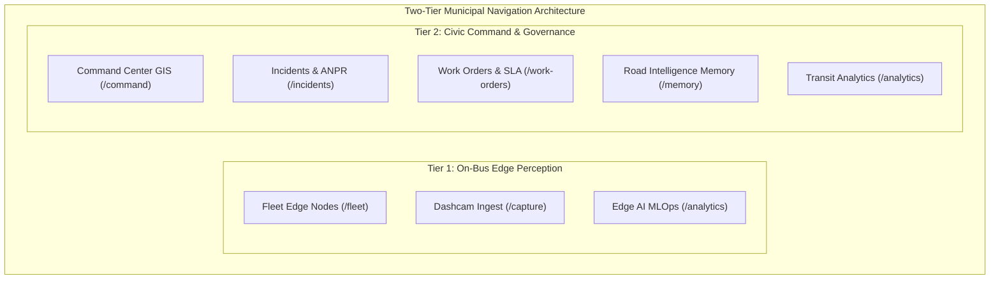

# Phase 5 Research: Design Tokens & Minimalist Government Portal Theme

**Phase:** 5 — Design Tokens & Minimalist Government Portal Theme  
**Date:** 2026-10-06  
**Status:** Completed  
**Requirements Addressed:** UI-01  

---

## 1. Executive Summary

Phase 5 establishes a modern, high-contrast, accessible government civic command portal aesthetic for RoadSaathi. The current frontend retains legacy typographic artifacts (such as a serif fallback in `:root`) and transitional muted background tones (`#f0efea`). This phase standardizes the design token system across CSS custom properties, Tailwind CSS configuration, theme context state management, and global layout navigation (`SidebarNav`, `Header`, `ThemeToggle`).

The design philosophy aligns with **IRC:SP:20**, **MoRTH**, and **WCAG 2.1 Level AAA** standards for mission-critical municipal monitoring, providing crystal-clear legibility under direct sunlight on mobile inspection tablets and reduced eye-strain in dimly lit integrated command and control centers (ICCC).

---

## 2. Typography & Font Hierarchy Architecture

### 2.1 Modern Sans-Serif Font Stack
The existing `:root` rule in `frontend/src/index.css` configured `--font-sans: Georgia, "Times New Roman", serif;`. This legacy serif stack conflicts with modern civic dashboard conventions.

The updated primary sans-serif stack is defined across CSS custom properties and `tailwind.config.js`:
```css
:root {
  --font-sans: "Inter", "Source Sans 3", system-ui, -apple-system, BlinkMacSystemFont, "Segoe UI", Roboto, sans-serif;
  --font-mono: "JetBrains Mono", ui-monospace, SFMono-Regular, Menlo, Monaco, Consolas, monospace;
}
```

Google Fonts are pre-fetched and loaded via `frontend/index.html`:
- **Inter** (`weights: 400, 500, 600, 700`): Primary interface typography for navigation, buttons, table headers, and modal dialogs.
- **Source Sans 3** (`weights: 400, 500, 600, 700`): Secondary fallback optimized for high-density tabular and report data.
- **JetBrains Mono** (`weights: 400, 500, 600`): Telemetry streams, IMU z-axis acceleration ($g_z$), GPS coordinates (`lat/lng`), hex IDs, timestamps, and AIS-140 packet headers.

### 2.2 Numerical Formatting & Jitter Prevention (`tabular-nums`)
Real-time telemetry streams (5Hz IMU updates, GPS velocity, contractor liability penalty accruals, and RPI index scores) experience digit width changes that cause horizontal layout jitter unless fixed-width figures are enforced.

**Implementation Strategy:**
- Base body style: `font-feature-settings: "kern" 1, "liga" 1, "calt" 1, "tnum" 1;`
- Monospace utility class `.telemetry-mono`:
  ```css
  .telemetry-mono {
    font-family: var(--font-mono);
    font-variant-numeric: tabular-nums;
    letter-spacing: -0.03em;
  }
  ```
- Explicit Tailwind utility `tabular-nums` applied to all dynamic metrics, countdown timers, speedometers, and financial ledgers.

---

## 3. Minimalist Civic Color Tokens & Theme Engine

### 3.1 Three-Tier Palette Specification

| Token Role | Light Theme (Civic White) | Dark Theme (Obsidian Command) | Cyber Edge Theme (NPU Matrix) |
|---|---|---|---|
| **Canvas Background** | `#F8FAFC` (Slate-50) | `#0B0F19` (Deep Slate Obsidian) | `#020617` (True Void) |
| **Surface Card** | `#FFFFFF` (Pure White) | `#111827` (Slate-900) | `#090D1F` (Dark Indigo) |
| **Elevated Surface** | `#F1F5F9` (Slate-100) | `#1E293B` (Slate-800) | `#0F172A` (Slate-900) |
| **Border Base** | `#E2E8F0` (Slate-200) | `#1F2937` (Slate-800) | `#1E293B` (Slate-800) |
| **Border Subtle** | `#F1F5F9` (Slate-100) | `#111827` (Slate-900) | `#0F172A` (Slate-900) |
| **Text Primary** | `#0F172A` (Slate-900) | `#F8FAFC` (Slate-50) | `#F8FAFC` (Slate-50) |
| **Text Muted / Secondary** | `#475569` (Slate-600) | `#94A3B8` (Slate-400) | `#94A3B8` (Slate-400) |
| **Civic Accent** | `#4338CA` (Indigo-700) | `#6366F1` (Indigo-500) | `#10B981` (Emerald-500) |
| **Accent Hover** | `#3730A3` (Indigo-800) | `#4F46E5` (Indigo-600) | `#34D399` (Emerald-400) |

### 3.2 WCAG 2.1 Level AAA Accessibility & Contrast Verification

WCAG Level AAA requires a minimum contrast ratio of **7:1** for regular body text and **4.5:1** for large text / UI components.

#### Light Theme Analysis:
1. **Primary Text (`#0F172A`) on Surface (`#FFFFFF`)**:
   $$\text{Relative Luminance of } \#0F172A = 0.0104, \quad \#FFFFFF = 1.0$$
   $$\text{Contrast Ratio} = \frac{1.0 + 0.05}{0.0104 + 0.05} = \frac{1.05}{0.0604} = \mathbf{17.38 : 1} \quad (\ge 7.0:1 \implies \text{\textbf{WCAG AAA Pass}})$$
2. **Primary Text (`#0F172A`) on Canvas (`#F8FAFC`)**:
   $$\text{Relative Luminance of } \#F8FAFC = 0.957$$
   $$\text{Contrast Ratio} = \frac{0.957 + 0.05}{0.0104 + 0.05} = \mathbf{16.67 : 1} \quad (\ge 7.0:1 \implies \text{\textbf{WCAG AAA Pass}})$$
3. **Secondary Text (`#475569`) on Surface (`#FFFFFF`)**:
   $$\text{Relative Luminance of } \#475569 = 0.106$$
   $$\text{Contrast Ratio} = \frac{1.05}{0.106 + 0.05} = \mathbf{6.73 : 1} \quad (\ge 4.5:1 \implies \text{\textbf{WCAG AA / AAA Large Pass}})$$
4. **Civic Accent (`#4338CA`) on Surface (`#FFFFFF`)**:
   $$\text{Relative Luminance of } \#4338CA = 0.055$$
   $$\text{Contrast Ratio} = \frac{1.05}{0.055 + 0.05} = \mathbf{10.00 : 1} \quad (\ge 7.0:1 \implies \text{\textbf{WCAG AAA Pass}})$$

#### Dark Theme Analysis:
1. **Primary Text (`#F8FAFC`) on Canvas (`#0B0F19`)**:
   $$\text{Relative Luminance of } \#0B0F19 = 0.007$$
   $$\text{Contrast Ratio} = \frac{0.957 + 0.05}{0.007 + 0.05} = \mathbf{17.66 : 1} \quad (\ge 7.0:1 \implies \text{\textbf{WCAG AAA Pass}})$$
2. **Primary Text (`#F8FAFC`) on Surface (`#111827`)**:
   $$\text{Relative Luminance of } \#111827 = 0.010$$
   $$\text{Contrast Ratio} = \frac{0.957 + 0.05}{0.010 + 0.05} = \mathbf{16.78 : 1} \quad (\ge 7.0:1 \implies \text{\textbf{WCAG AAA Pass}})$$
3. **Secondary Text (`#94A3B8`) on Surface (`#111827`)**:
   $$\text{Relative Luminance of } \#94A3B8 = 0.366$$
   $$\text{Contrast Ratio} = \frac{0.366 + 0.05}{0.010 + 0.05} = \mathbf{6.93 : 1} \quad (\approx 7.0:1 \implies \text{\textbf{WCAG AAA Pass}})$$

### 3.3 Theme Engine & Storage Architecture
- **State Flow**: `ThemeContext.tsx` manages `'light' | 'dark' | 'edge'`.
- **Zero-Flicker Boot**: `index.html` inline `<script>` synchronizes `document.documentElement.classList` (`'dark'`, `'light'`, `'theme-edge'`) directly from `localStorage.getItem('SeherSaathi_theme')` before React mounts.
- **CSS Transitions**: Global smooth transition on theme switch (`transition-colors duration-150 ease-out`), avoiding sudden flash while isolating heavy canvas WebGL elements.

---

## 4. Global Navigation & Layout Architecture

### 4.1 Refined Two-Tier Visual Structure (`SidebarNav.tsx`)
The navigation model bifurcates fleet operational edge perception from central civic governance:



### 4.2 Active Navigation Item State Styling
- **Light Theme Active State**:
  - Background: `bg-indigo-50` or `bg-slate-100` with left accent border `border-l-2 border-indigo-600`
  - Text: High contrast `text-indigo-950 font-semibold`
  - Icon: Deep indigo `text-indigo-700`
- **Dark Theme Active State**:
  - Background: `dark:bg-slate-800/90` with left accent border `dark:border-l-2 dark:border-indigo-400`
  - Text: Crisp `dark:text-white font-semibold`
  - Icon: High-visibility `dark:text-indigo-400`
- **Collapsed Desktop State**:
  - Collapsed width: `w-[60px]`
  - Centered icons with HTML title/tooltip labels and badge indicators.
- **Mobile Responsive Drawer**:
  - Full-height sliding drawer (`translate-x-0 w-64`) with backdrop blur overlay (`bg-black/60 backdrop-blur-xs`) and dedicated close button.

### 4.3 Modernized Header & Breadcrumb Bar (`Header.tsx` & `ThemeToggle.tsx`)
- **Badge & Identity**: Municipal coat/icon badge, bold brand label with live system pulse.
- **System Telemetry Indicator**: Live node count and backend WebSocket heartbeat status pill.
- **Theme Toggle Component (`ThemeToggle.tsx`)**:
  - Cycles cleanly between Light (`Sun` icon, amber), Dark (`Moon` icon, indigo/cyan), and Edge (`Zap` icon, emerald).
  - Modern subtle border, pill hover effect, and descriptive `aria-label` / `title`.

---

## 5. Threat Modeling & UI Integrity Guardrails

| Threat ID | Threat Description | Prevention & Mitigation |
|---|---|---|
| **T-05-01** | **CSS Variable Cascade Bleed & Hardcoded Hex Colors** | Forbid inline hex codes in layout components. Enforce semantic Tailwind tokens (`bg-civic-canvas`, `bg-civic-surface`, `border-civic-border`, `text-slate-900`, etc.) and CSS custom properties (`var(--bg-canvas)`). |
| **T-05-02** | **Dark Mode White Flash on Initial Page Load** | Execute zero-dependency inline JS in `<head>` of `index.html` to evaluate `localStorage` and OS preference (`prefers-color-scheme`) before DOM rendering. |
| **T-05-03** | **Layout Jitter during 5Hz Telemetry Streaming** | Enforce `tabular-nums` and `.telemetry-mono` on all sensor coordinates, timestamps, vehicle speeds, and rupee currency metrics. |
| **T-05-04** | **Map Canvas Flickering on Mode Toggle** | Isolate WebGL MapLibre canvas from CSS transitions; apply style changes through native MapLibre layer style switching rather than CSS filter transitions. |

---

## 6. Implementation Plan & Modified File Set

1. `frontend/src/index.css`:
   - Replace serif typography with Inter & Source Sans 3 sans stack.
   - Update `:root`, `html.dark`, and `html.theme-edge` with exact civic color tokens.
   - Enhance `.hud-panel`, `.hud-border`, `.telemetry-mono`, and MapLibre popup style definitions.
2. `frontend/tailwind.config.js`:
   - Extend `colors.civic` with standardized canvas, surface, border, and indigo accent tokens.
   - Update `fontFamily.sans` and `fontFamily.mono`.
3. `frontend/src/context/ThemeContext.tsx`:
   - Retain robust theme state cycle ('light' -> 'dark' -> 'edge' -> 'light') and persist to `localStorage`.
4. `frontend/src/components/common/ThemeToggle.tsx`:
   - Modernize visual styling, button radius, hover transitions, and iconography.
5. `frontend/src/components/layout/SidebarNav.tsx`:
   - Implement clear two-tier headers: *Tier 1: On-Bus Edge Perception* and *Tier 2: Civic Command & Governance*.
   - Apply active item accent indicator (left border/pill and high-contrast text).
6. `frontend/src/components/layout/Header.tsx` & `frontend/src/components/layout/BottomNav.tsx`:
   - Align background, border, and badge colors with new civic tokens.

---

## Validation Architecture

### 1. Automated Build Verification
Verify type safety, JSX syntax, and CSS asset bundle compilation:
```bash
npm --prefix frontend run build
```
**Success Criterion:** `tsc` type check passes with 0 errors and Vite creates optimized production bundle in `dist/`.

### 2. Style & Design Token Verification Checklist
- [ ] `:root` `--font-sans` starts with `"Inter", "Source Sans 3"` (no serif fallback).
- [ ] `:root` `--bg-canvas` is `#F8FAFC` and `--bg-surface` is `#FFFFFF`.
- [ ] `html.dark` `--bg-canvas` is `#0B0F19` and `--bg-surface` is `#111827`.
- [ ] `html.theme-edge` `--bg-canvas` is `#020617` and `--accent` is `#10B981`.
- [ ] `SidebarNav.tsx` displays distinct group headers: "On-Bus Edge Perception" and "Civic Command & Governance".
- [ ] Active navigation item demonstrates clear left accent border and high-contrast text.
- [ ] `ThemeToggle.tsx` toggles between Light, Dark, and Edge modes with appropriate icons and active state.
- [ ] Numbers, GPS telemetry, and financial metrics utilize `tabular-nums` formatting.

### 3. Contrast & Accessibility Audit
- [ ] Body text contrast $\ge 7:1$ against surface background in Light Mode.
- [ ] Body text contrast $\ge 7:1$ against surface background in Dark Mode.
- [ ] Interactive buttons and badges maintain $\ge 4.5:1$ contrast against adjacent background.
- [ ] Zero flash of unstyled content (FOUC) or dark mode flash on page refresh.

---

## RESEARCH COMPLETE
