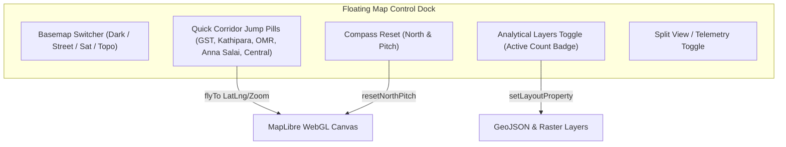
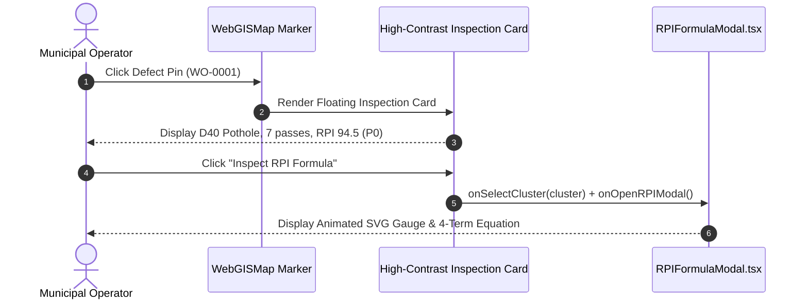

# Phase 6 Research: WebGIS Map HUD & Interactive Inspection Overlays

**Phase:** 6 — WebGIS Map HUD & Interactive Inspection Overlays  
**Target Architecture:** MapLibre GL JS v4, React 18, Tailwind CSS Glassmorphism, WebGIS Telemetry  
**Requirements Addressed:** UI-02  
**Date:** 2026-10-07  

---

## 1. Executive Summary & Problem Space

RoadSaathi's command center relies on MapLibre GL JS to provide real-time spatial awareness across metropolitan transit networks (Chennai pilot: GST Road, Kathipara Cloverleaf, OMR IT Expressway, Anna Salai CBD, Central Station Link). 

In earlier iterations, map controls, analytical layer selectors, and popup inspectors were dispersed across multiple disconnected elements or basic inline HTML strings. Phase 6 modernizes the WebGIS experience into a cohesive, high-performance command HUD featuring:
1. **Glassmorphic Floating Map Control Dock & Quick Corridor Navigation**: A floating pill toolbar with quick corridor jumps (`map.flyTo`), heading compass reset, basemap switcher, and split-view toggle.
2. **High-Contrast Cluster Inspection Popup Cards**: Rich, accessible floating forensic cards with before/after thumbnails, defect code badges (`D40 Pothole`, `D20 Alligator Crack`), pass consensus counts, color-coded RPI score pills (P0 Critical, P1 High, P2 Routine), and direct 1-click hooks to [`RPIFormulaModal.tsx`](file:///c:/Users/sauja/Downloads/roads/frontend/src/components/modals/RPIFormulaModal.tsx).
3. **Streamlined Zero-Flicker Layer Visibility Menu**: An organized dropdown/drawer controlling 6 analytical map layers (Defect Clusters, Live Transit Fleet, PS 26124 OD Desire Lines, Monsoon Flood Inundation Contours, Sensitive POIs, and Traffic Flow Bottlenecks) leveraging reactive MapLibre `setLayoutProperty('visibility')` and `setData()` calls without WebGL context destruction.

---

## 2. Technical Investigation & Architecture

### 2.1 Floating Map Control Dock & Quick Corridor Jump Architecture

#### Visual Design & Token Specifications
The floating control dock sits at the top of the map viewport, elevated above map layers with glassmorphic styling matching Phase 5 civic tokens:
- **Container Classes**: `backdrop-blur-md bg-white/90 dark:bg-slate-900/90 border border-slate-200/80 dark:border-slate-800/80 shadow-float rounded-2xl`
- **Layout**: Horizontal pill layout with responsive wrapping/collapsing for compact mobile viewports (`< 768px`).



#### Quick Corridor Navigation Coordinates & Animation Parameters
To ensure responsive spatial auditing, predefined arterial corridor coordinates are animated smoothly with `map.flyTo`:

| Corridor Identifier | Center [Lng, Lat] | Zoom | Pitch | Bearing | Speed / Curve |
|---|---|---|---|---|---|
| **GST Road (NH-32)** | `[80.1462, 12.9516]` | 15.0 | 35° | -10° | `speed: 1.2, curve: 1.4` |
| **Kathipara Cloverleaf** | `[80.2030, 13.0067]` | 15.2 | 45° | 25° | `speed: 1.2, curve: 1.4` |
| **OMR IT Expressway** | `[80.2500, 12.9719]` | 14.8 | 30° | 0° | `speed: 1.2, curve: 1.4` |
| **Anna Salai CBD** | `[80.2496, 13.0604]` | 15.0 | 40° | -15° | `speed: 1.2, curve: 1.4` |
| **Central Station Link**| `[80.2707, 13.0827]` | 15.4 | 35° | 10° | `speed: 1.2, curve: 1.4` |

#### FlyTo Implementation Pattern
```typescript
const handleCorridorJump = (corridor: typeof CHENNAI_QUICK_CORRIDORS[number]) => {
  const map = mapRef.current;
  if (!map) return;
  map.flyTo({
    center: [corridor.lng, corridor.lat],
    zoom: corridor.zoom,
    pitch: corridor.pitch ?? 35,
    bearing: corridor.bearing ?? 0,
    speed: 1.2,
    curve: 1.4,
    essential: true
  });
};
```

---

### 2.2 High-Contrast Cluster Inspection Popup Cards

#### High-Contrast Forensic Layout
When an operator clicks a defect cluster marker, a high-contrast floating card appears with structured forensic metadata:
1. **Header Banner**: Defect Type Badge (e.g., `D40 Severe Pothole Cavity` or `D20 Alligator Crack`), RPI Priority Pill (`P0 CRITICAL` in rose-500, `P1 HIGH` in amber-500, `P2 ROUTINE` in blue-500).
2. **Forensic Preview**: Dual before/after split thumbnail or high-resolution annotated keyframe showing edge AI bounding box.
3. **Multi-Pass Telemetry Row**:
   - Pass Consensus Count (`5 Fleet Passes confirmed`)
   - Maximum Vertical IMU Acceleration (`gz: 1.58g`)
   - Road Hierarchy & Speed Class (`National Highway NH-32 · 50 km/h Limit`)
   - Nearest Sensitive POI (`MIOT International Hospital · 240m`)
4. **Interactive Action Bar**:
   - Primary CTA: **"Inspect RPI Formula"** &rarr; triggers `onOpenRPIModal` pre-populated with active cluster parameters.
   - Secondary CTA: **"Create / View Work Order"** &rarr; dispatches or opens contractor SLA docket.

#### Data Binding with `RPIFormulaModal.tsx`
The inspection card exposes a direct TypeScript callback to open [`RPIFormulaModal.tsx`](file:///c:/Users/sauja/Downloads/roads/frontend/src/components/modals/RPIFormulaModal.tsx):
```typescript
interface InspectionCardProps {
  cluster: HazardCluster;
  onInspectRPI: (cluster: HazardCluster) => void;
  onDispatchWorkOrder?: (clusterId: string) => void;
  onClose: () => void;
}
```



---

### 2.3 Streamlined Layer Visibility Menu

#### Supported Analytical Layers

| Layer ID | Name | Source Type | Render Mechanism | Default State |
|---|---|---|---|---|
| `potholes-heat-layer` | Defect Clusters & Heatmap | GeoJSON Point | `heatmap` & DOM Markers | Visible (Active) |
| `bus-positions` | Transit Fleet Live Buses | GeoJSON Point | `circle` Pulse & 5Hz Markers | Visible (Active) |
| `od-desire-lines-layer`| PS 26124 OD Desire Lines | GeoJSON LineString | `line` Bezier Arcs | User Toggled |
| `monsoon-contours-layer`| Monsoon Hydro Contours | GeoJSON Polygon | `fill` & `line` Contours | User Toggled |
| `poi-sensitive-layer` | Sensitive POIs (Hospitals/Schools) | GeoJSON Point / Markers | `circle` & Symbol Markers | Visible (Active) |
| `traffic-congestion-lines`| Traffic Bottlenecks & Congestion | GeoJSON LineString | `line` Traffic Flow Polylines | User Toggled |

#### Zero-Flicker Toggle Engine
To avoid WebGL context loss or layer recreation flashing:
1. All GeoJSON sources are registered once on `map.on('load')` or during initial mount.
2. Layer toggles exclusively call `map.setLayoutProperty(layerId, 'visibility', isVisible ? 'visible' : 'none')`.
3. Dynamic telemetry updates exclusively call `(map.getSource(srcId) as maplibregl.GeoJSONSource).setData(geojson)`.

```typescript
const toggleLayerVisibility = (layerId: string, visible: boolean) => {
  const map = mapRef.current;
  if (!map || !map.getLayer(layerId)) return;
  map.setLayoutProperty(layerId, 'visibility', visible ? 'visible' : 'none');
};
```

---

## 3. Threat Model & Boundaries

- **T-06-01 (Memory Leak via Uncleaned MapLibre Popups/Markers)**:
  - *Risk*: Repeatedly opening popups without destroying previous DOM marker instances creates detached DOM tree leaks.
  - *Mitigation*: Maintain reference dictionaries (`markersRef`, `busMarkersRef`, `incidentMarkersRef`) and remove detached instances during component cleanup.
- **T-06-02 (Mobile Viewport HUD Clipping)**:
  - *Risk*: On screens `< 768px`, wide floating pill bars can overflow the screen horizontally, obscuring map interactions.
  - *Mitigation*: Use responsive Tailwind breakpoints (`flex-wrap`, scrollable quick-jump pills `overflow-x-auto custom-scrollbar`, and collapsible layer drawer).
- **T-06-03 (Desynchronized RPI Modal State)**:
  - *Risk*: Triggering RPI formula calculation from map popups with stale cluster references causes wrong math to be shown.
  - *Mitigation*: Pass the full active `HazardCluster` instance directly to `onSelectCluster` before triggering `onOpenRPIModal`.

---

## 4. Validation Architecture

### 4.1 Automated Build Verification
The frontend build pipeline verifies TypeScript typings, component contracts, and Vite production bundle generation:
```bash
npm --prefix frontend run build
```

Expected Output:
- `tsc && vite build` succeeds with exit code 0.
- Production chunks (`dist/assets/vendor-map-*.js`, `dist/assets/index-*.js`) compiled cleanly.

### 4.2 UI Inspection Checklist

1. **Floating Map Control Dock**:
   - [ ] Floating dock is anchored top-center/right with `backdrop-blur-md bg-white/90 dark:bg-slate-900/90`.
   - [ ] All 5 quick corridor jump buttons (GST Road, Kathipara, OMR, Anna Salai, Central Station) smoothly animate camera via `map.flyTo`.
   - [ ] Compass reset button restores bearing to 0° and pitch to default.
   - [ ] Basemap mode switcher cycles smoothly between Dark, Street, Satellite, and Topo without map redraw flashes.
2. **High-Contrast Cluster Inspection Popup Cards**:
   - [ ] Clicking any defect marker displays a high-contrast popup card.
   - [ ] Card presents defect code badge (`D40` / `D20`), road name, pass consensus count, and color-coded RPI score pill.
   - [ ] Clicking "Inspect RPI Formula" opens [`RPIFormulaModal.tsx`](file:///c:/Users/sauja/Downloads/roads/frontend/src/components/modals/RPIFormulaModal.tsx) populated with real defect metrics.
3. **Streamlined Layer Visibility Menu**:
   - [ ] Layer dropdown displays active count badge when analytical layers are enabled.
   - [ ] Toggling Defect Clusters, Transit Fleet, OD Desire Lines, Monsoon Contours, POIs, and Bottlenecks applies immediately without WebGL context reset.
   - [ ] OD Desire Lines render curved Bezier arcs with interactive corridor popup stats.

---

## RESEARCH COMPLETE
